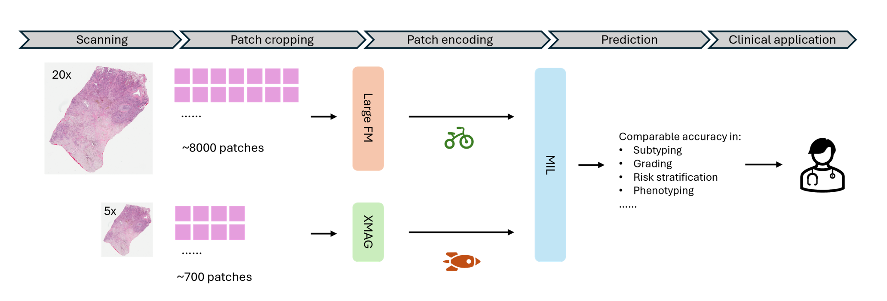
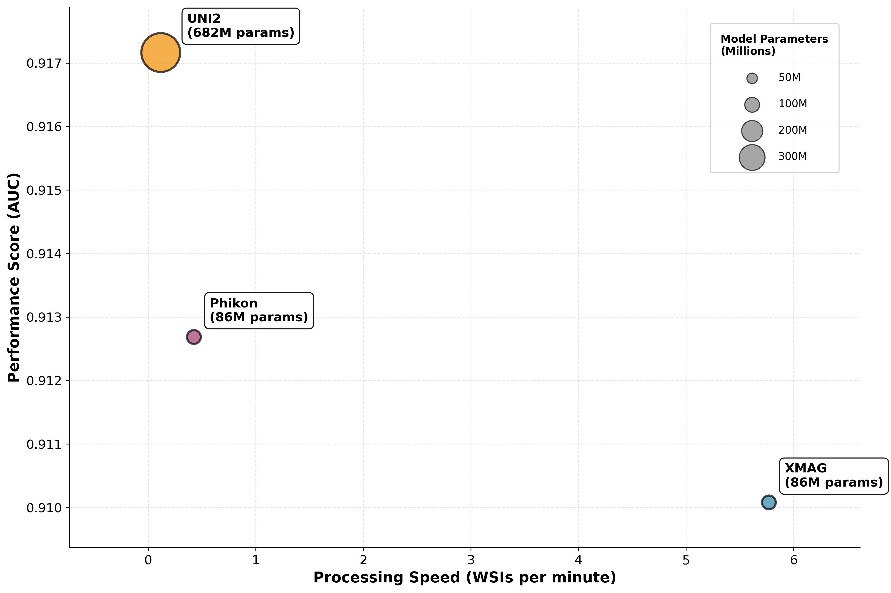

# 🧬 XMAG: Cross-Magnification Distillation for Efficient Pathology Foundation Model

<p align="center">
  
</p>

<p align="left">
  
</p>

---

**XMAG** is a streamlined **pathology foundation model** trained via **cross-magnification distillation**, enabling accurate and efficient whole-slide image (WSI) encoding at **5× magnification**.  
Despite operating at lower resolution, XMAG achieves performance comparable to state-of-the-art pathology foundation models trained at 20× or 40× magnification — while being up to **30× faster** during inference.

--- 

## Model Checkpoints

Pretrained model weights can be downloaded here:  
👉 [XMAG-5× Checkpoint (Google Drive)](https://drive.google.com/file/d/1RiXa-ZvJ_VorvwgnEffJDIWYTGt_1YBF/view?usp=sharing)

---

## Usage

#### Install dependencies
```
pip install -r requirements.txt
```

#### To generate image embeddings, navigate to the `encoding` directory and run:

```bash
python encode.py
```

## Citation
If you use XMAG in your research, please cite:
```
@article{su2025xmag,
  title={XMAG: Cross-Magnification Distillation for Efficient Pathology Foundation Model},
  author={Su, Ziyu and et al.},
  journal={TBD},
  year={2025}
}
```


## License
This code is licensed under the **PolyForm Noncommercial License 1.0.0**.  
You may use it for research, academic, or other noncommercial purposes.  
See the [LICENSE](LICENSE) file or visit [polyformproject.org/licenses/noncommercial/1.0.0](https://polyformproject.org/licenses/noncommercial/1.0.0) for details.
